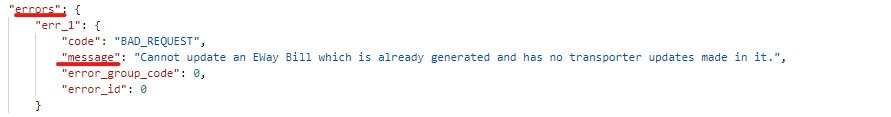
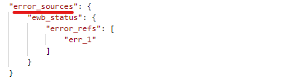

# Error Master

#### Response Structure:

ClearTax Error response will always tell you 2 things:

1. What is the error?
2. Where is the error?

You can get this error responce with different HTTP status code based on the API you are consuming. Example: You can get it with `400` Bad Request or with `200` OK

The `errors`object under `errorResponse`will always have the list of errors found in your payload. The `message` will explain what the error is and it's always paired with the `error_id`Error response

The `error_sources` object will direct you to the specific field in which the error was found.

#### ClearTax Error message list

| Error Message |
| :--- |
| E-Way bill id in url did not match with payload id |
| Invalid GSTIN &lt;GSTINNumberHere&gt;, please provide a valid &lt;Seller/Receiver&gt; GSTIN |
| Supplier GSTIN is different from the Account GSTIN |
| Customer Billing GSTIN is different from the Account GSTIN |
| Receiver GSTIN is mandatory for Deemed or SEZ export |
| Seller GSTIN is mandatory for Import from SEZ |
| Please add atleast one line item in the invoice before saving |
|  |
|  |
|  |
|  |
|  |
|  |

