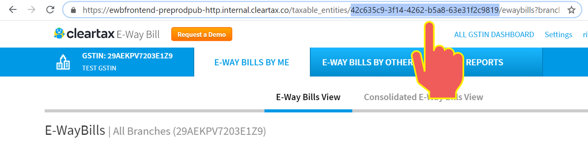
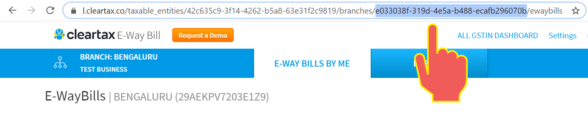

# Learn E-Waybill API Basics

## [E Waybill Rules & Generation Process Explained](https://cleartax.in/s/eway-bill-gst-rules-compliance)

ClearTax E-Waybill API is your gateway for introducing E-Waybill compliance in your app. Start here to learn about the core components available for you to build with, and to get some guidance on how to start thinking about designing apps with ClearTax E-waybill API. This is intended to be an overview of the core platform components that are available to help you better understand the APIs.

## Why ClearTax E-Waybill API?

Enterprises and Transporters can integrate with ClearTax E-Waybill APIs with their ERP or source system so that E-Waybills can be generated quickly, seamlessly and error-free directly from their ERP or source system. 

ClearTax E-Waybill API integration provides a robust, scalable and compliant method of generating E-Waybills with following advantages:

* E-Waybills are generated quickly \(in few seconds\).
* E-Waybill data like the bill number, E-Waybill generated date, etc. can be stored back in their ERP or source system.
* Warehouse and logistic team members of Enterprise clients can continue to use E-Waybill directly from the existing warehousing and logistics software without any need to login to ClearTax E-Waybill portal.
* Finance and Warehouse head of enterprises can use ClearTax E-Waybill portal for their reporting needs.

## **ClearTax User Account**

Every user who registers with ClearTax E-Waybill gets an account associated with the email ID used for signing up. A registered user can add any number of  GSTINs and Branches under their account and manage all of them from the same login. A user can log in to ClearTax E-Waybill with the email ID and password or can interact with ClearTax E-Waybill programmatically with an Auth token. To generate an auth token, please get in touch with the ClearTax E-Waybill Sales Team.

## **Taxable Entity ID**

Every business on ClearTax E-Waybill can have multiple GSTINs. Every time a user creates a new GSTIN under his business, ClearTax will assign an ID to that user’s instance of that GSTIN \(taxable entity\), commonly referred to as Taxable Entity ID. This ID is unique to that taxable entity and cannot be used by any other user unless the admin user gives access to it.

Whenever you send an API request to get or update GSTIN level information, you will include the Taxable Entity ID in the URL of the request to identify which GSTIN you are referring to.

You can get the Taxable Entity ID of your GSTIN by logging in to your ClearTax account and selecting the "E-Waybills by Me" option against your GSTIN as shown in the highlighted part of URL in the below image:

## Branch Entity ID

Under every GSTIN many branches can be their to serve the need to depot or store locations based on GSTIN. Every time a user creates a new branch under his GSTIN, ClearTax will assign an ID to that user’s instance of that branch\(branch id\), commonly referred to as Branch ID.This branch ID is unique to that branch and cannot be used by any other user unless the admin user gives access to it.

Whenever you send an API request to get or update branch level information, you will include the branch ID in the URL of the request to identify which branch you are referring to.

You can get the Branch Entity ID of your Branch by logging in to your ClearTax account and selecting the "E-Waybills by Me" option against your Branch as shown in the highlighted part of URL in the below image:

## Templates or Formats

* ClearTax Template
* Govt Template
* Custom Template

### **ClearTax Template**

These templates are created by ClearTax and used by most of our customers. If you are new to E-Waybill file formats, we recommend these templates for your app as they are simpler and more flexible. Whether you use Excel or CSV, each document type can be sent in this file. In case of Excel, ClearTax Template supports only the first sheet in the workbook.  
[Click here to download ClearTax Template](https://cleartax-media.s3.amazonaws.com/cleargst/excel/EWB_Template_v0.2.xlsx)  
  
After downloading above template, open the file and you will get below sheets  
1. EWB \( Sheet where user will provide data for E-Waybill generation \)  
2. Explanation of EWAY BILL \(Explanation of all columns with data types and sample value\)  
3. State Code definition \(State code explanation\)

### **Govt Template**

These templates are created by NIC E-Waybill portal \(GSTN\). You have options to export data in this format. So, if your app uses the same format, you can use these templates to generate the Excel or CSV to be imported to ClearTax. 

### Custom Template

Custom templates are handled in the same way as ClearTax templates. The benefit here is, you will be able to specify your own headers and map it to the header required by ClearTax. When you create a new custom template, you will receive a custom\_mapper\_id which you will have to specify as request parameter when uploading files to ClearTax E-Waybill application.

## Supply Type - Document Type Mapping

| **Transaction Type** | **Transaction Sub-Type** | **Document Type** | **From GSTIN \(Supplier\)** | **To GSTIN \(Buyer\)** |
| :--- | :--- | :--- | :--- | :--- |
| Outward | Supply | Tax Invoice | Self | Other GSTIN/URP |
| Outward | Supply | Bill of Supply | Self | Other GSTIN/URP |
| Outward | Export | Tax Invoice | Self | Other GSTIN/URP |
| Outward | Export | Bill of Supply | Self | Other GSTIN/URP |
| Outward | Job Work | Delivery Challan | Self | Other GSTIN/URP |
| Outward | SKD/CKD/Lots | Tax Invoice | Self | Other GSTIN/URP |
| Outward | SKD/CKD/Lots | Bill of Supply | Self | Other GSTIN/URP |
| Outward | SKD/CKD/Lots | Delivery Challan | Self | Other GSTIN/URP |
| Outward | Recipient not known | Delivery Challan | Self | Self |
| Outward | Recipient not known | Others | Self | Self |
| Outward | For own Use | Delivery Challan | Self | Self |
| Outward | Exhibition or fairs | Delivery Challan | Self | Self |
| Outward | Line Sales | Delivery Challan | Self | Self |
| Outward | Others | Delivery Challan | Self | Self/Other/URP |
| Outward | Others | Others | Self | Self/Other/URP |
| Inward | Supply | Tax Invoice | Other GSTIN/URP | Self |
| Inward | Supply | Bill of Supply | Other GSTIN/URP | Self |
| Inward | Import | Bill of Entry | Other GSTIN/URP | Self |
| Inward | SKD/CKD/Lots | Bill of Entry | URP | Self |
| Inward | SKD/CKD/Lots | Tax Invoice | Other GSTIN/URP | Self |
| Inward | SKD/CKD/Lots | Bill of Supply | Other GSTIN/URP | Self |
| Inward | SKD/CKD/Lots | Delivery Challan | Other GSTIN/URP | Self |
| Inward | Job Work Returns | Delivery Challan | Other GSTIN/URP | Self |
| Inward | Sales Return | Delivery Challan | Other GSTIN/URP | Self |
| Inward | Exhibition or fairs | Delivery Challan | Self | Self |
| Inward | For own Use | Delivery Challan | Self | Self |
| Inward | Others | Delivery Challan | Self/Other/URP | Self |
| Inward | Others | Others | Self/Other/URP | Self |

