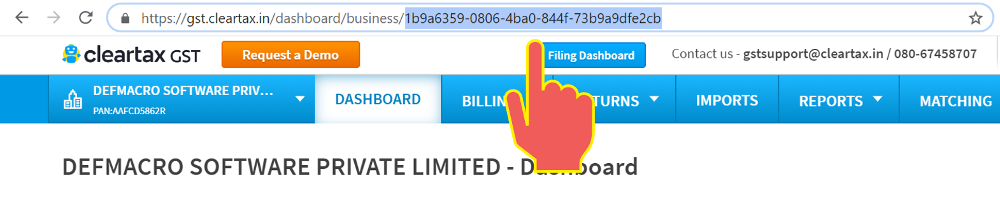
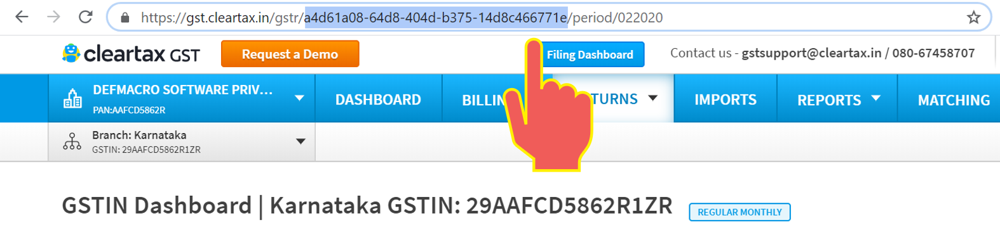

# Learn GST API Basics

ClearTax GST API is your gateway for introducing GST compliance in your app. Start here to learn about the core components available for you to build with, and to get some guidance on how to start thinking about designing apps with ClearTax GST API. This is intended to be an overview of the core platform components that are available to help you better understand the APIs.

## ClearTax User Account

Every user who registers with ClearTax GST gets an account associated with the email ID used for signing up. A registered user can add any number of Businesses/Clients and GSTINs under their account and manage all of them from the same login. A user can log in to ClearTax GST with the email ID and password or can interact with ClearTax GST programmatically with an authentication token.





## Business ID

Every user account on ClearTax GST can have multiple businesses or clients. A business can be a group of GSTINs related to the same real world legal entity or person. Every time a user creates a new business or client in their account, ClearTax will assign an ID to that business or client, commonly referred to as Business ID. This ID is unique to that business or client, and cannot be used by any other user unless the admin user gives access to it.

Whenever you send an API request to get or update business level information, you will include the Business ID in the URL of the request as a path parameter to identify which business you are referring to.

You can get the Business ID of your Business by logging in to your ClearTax account and selecting the "Business Name/PAN" as shown in the highlighted part of URL in the below image:

## Taxable Entity ID

Every business or client on ClearTax GST can have multiple GSTINs. Every time a user creates a new GSTIN under any of his businesses or clients, ClearTax will assign an ID to that user’s instance of that GSTIN \(taxable entity\), commonly referred to as Taxable Entity ID. This ID is unique to that taxable entity, and cannot be used by any other user unless the admin user gives access to it.

Whenever you send an API request to get or update GSTIN level information, you will include the Taxable Entity ID in the URL of the request as a path parameter to identify which GSTIN you are referring to.

You can get the Taxable Entity ID of your GSTIN by logging in to your ClearTax account and selecting the "GSTIN" as shown in the highlighted part of URL in the below image:

## Documents

A document is an official record issued by a seller, buyer or transporter involved in a business transaction. ClearTax GST supports the following types of documents:

| Outward Documents | Inward Documents |
| :--- | :--- |
| Sales Invoices | Purchase Invoices |
| Outward Bills of Supply | Inward Bills of Supply |
| Advance Receipts | Advance Payments |
| Outward Credit Debit Notes | Inward Credit Debit Notes |
| Delivery Challans |  |
| Estimates |  |

## Different ways to send data to ClearTax GST

ClearTax GST provides 2 ways to send data:

1. JSON Upload API
2. File Upload API

### JSON Upload API

The JSON Upload API gives you the ability to upload your documents to ClearTax GST with real-time validation check. With this API, you will be able to upload the following types of documents from your app in JSON format:

1. Sales or Purchase Invoices
2. Outward or Inward Bills of Supply
3. Advance Receipts or Payments
4. Outward or Inward Credit Debit Notes
5. Delivery Challans
6. Estimates

Using this API gets your documents validated in real time. Once a request containing documents is sent, the JSON Upload API will return response with validations that can be used to update the source database and inform the business user to fix and resend. This lets you build more tightly integrated apps, removing the necessity of business user logging into ClearTax Portal for fixing errors.



### File Upload API

The File Upload API gives you the ability to upload your documents to ClearTax GST with staged validation checks. With this API, you will be able to upload following types of documents from your local file system in CSV or Excel format:

1. Sales Invoices or Outward Bills of Supply
2. Purchase Invoices or Inward Bills of Supply
3. Advance Receipts
4. Advance Payments
5. Outward Credit Debit Notes
6. Inward Credit Debit Notes

Using this API gets your documents staged in ClearTax database, removing the overhead of correcting validation errors at the time of sending the documents. This lets business user send documents faster and in more efficient manner. Once a file containing documents is uploaded, the File Upload API will return an activity\_id that can be used for future requests to check upload status and validation errors.



## Templates or Formats

ClearTax GST supports uploading of 4 types of templates \(also called formats\).

1. Government Templates
2. ClearTax Templates
3. E-commerce Templates
4. Custom Templates

### Government Templates

These templates are created by Government \(GSTN\). Some offline accounting software like Tally and Busy have options to export data in this format. So if your app uses the same format, you can use these templates to generate the Excel or CSV to be imported to ClearTax. In case of Excel, Government Templates support different segments \(B2B, B2CS, etc\) in separate sheets of the same workbook and hence can be sent to ClearTax in single request. In case of CSV, each document type \(Invoice, CDN, etc\) and segment needs to be created as a separate file and sent in a separate request by specifying the `data_type` and `vendor_type` as request parameter.

### ClearTax Templates

These templates are created by ClearTax and used by most of our customers. If you are new to GST file formats, we recommend these templates for your app as they are simpler and more flexible. Whether you use Excel or CSV, each document type can be sent in a separate file by specifying the `data_type` as request parameter. In case of Excel, ClearTax Template supports only the first sheet in the workbook.

### E-commerce Templates

In addition to Government templates and ClearTax templates, ClearTax also supports E-commerce templates of the following:

* Amazon Sellers
  * Sales by sellers from Indian states
  * Sales by sellers from Union Territories
* Flipkart Sellers
  * Flipkart Sales Invoice
  * Flipkart Sales CDNs \(Outward Credit Debit Notes\)
* Paytm Sellers
  * Paytm Sales Invoice
  * Paytm Sales CDNs \(Outward Credit Debit Notes\)

### Custom Templates

Custom templates are handled in the same way as ClearTax templates. The benefit here is, you will be able to specify your own headers and map it to the header required by ClearTax. When you create a new custom template, you will receive a custom\_mapper\_id which you will have to specify as request parameter when uploading files to ClearTax GST.



